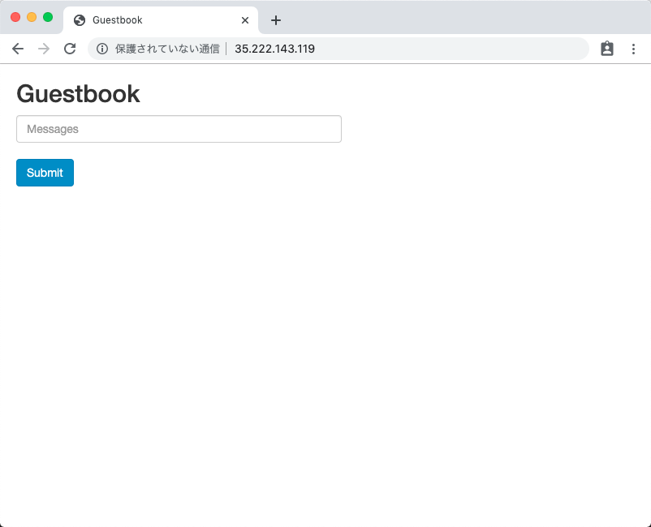

# Sample Guestbook

## 参考資料

このドキュメントは以下の公式ドキュメントを実際にやってみるサンプルです。

+ [GKE] Redis と PHP を使用したゲストブックの作成
    + https://cloud.google.com/kubernetes-engine/docs/tutorials/guestbook

## ソースコードの取得

+ ソースコードを取得し、ディレクトリに移動する

```
git clone https://github.com/iganari/package-kubernetes.git
cd package-kubernetes/sample_guestbook
```

## ゲストブックの作成方法

+ Namespace を作成する

```
kubectl create -f 01_namespace.yaml

export _namespace=$(cat 01_namespace.yaml | grep name | awk 'NR==1 {print $2}')
```

### 1. マスターの Redsis を用意する


+ マニュフェストファイルを指定して、マスターの Redis をデプロイします

```
kubectl create -f 11_redis-master-deployment.yaml
```

+ 作成したデプロイメントを確認する

```
kubectl get deployments --namespace ${_namespace}
```
```
### 例

# kubectl get deployments
NAME           DESIRED   CURRENT   UP-TO-DATE   AVAILABLE   AGE
redis-master   1         1         1            1           28m
```

+ Podが正常に作成されているか確認する

```
kubectl get pods --namespace sample-guestbook

or

kubectl get pods --namespace ${_namespace} | grep redis-master-
```
```
### 例

# kubectl get pods
NAME                            READY     STATUS    RESTARTS   AGE
redis-master-698964bc87-289rt   1/1       Running   0          7m
```

+ マスターのRedisのログを眺める

```
kubectl logs -f $(kubectl get pods --namespace ${_namespace} | grep redis-master- | awk '{print $1}') --namespace ${_namespace}
```

+ マスターのRedisのサービスの起動をする

```
kubectl create -f 12_redis-master-service.yaml 
```

+ サービスが作成されたことを確認する

```
kubectl get service --namespace ${_namespace}
```
```
### 例

# kubectl get service
NAME           TYPE        CLUSTER-IP    EXTERNAL-IP   PORT(S)    AGE
kubernetes     ClusterIP   10.0.0.1      <none>        443/TCP    14d
redis-master   ClusterIP   10.0.82.135   <none>        6379/TCP   1m
```

### 2. ワーカーのRedisを設定する

+ ワーカーのRedisをデプロイを作成する

```
kubectl create -f 21_redis-slave-deployment.yaml
```

+ Podが正常に作成されているか確認する

```
kubectl get pods

or

kubectl get pods --namespace ${_namespace} | grep redis-slave-
```

+ ワーカーのRedisのサービスを起動する

```
kubectl create -f 22_redis-slave-service.yaml
```

+ サービスが作成されたことを確認する

```
kubectl get service --namespace ${_namespace}
```
```
### 例

# kubectl get service --namespace ${_namespace}
NAME           TYPE        CLUSTER-IP    EXTERNAL-IP   PORT(S)    AGE
redis-master   ClusterIP   10.0.34.8     <none>        6379/TCP   9m45s
redis-slave    ClusterIP   10.0.36.117   <none>        6379/TCP   11s
```

### 3. フロントのPHPを設定する

+ フロント(PHP)のデプロイを作成する

```
kubectl create -f 31_frontend-deployment.yaml
```

+ Podが正常に作成されているか確認する

```
kubectl get pods --namespace ${_namespace}

or

kubectl get pods --namespace ${_namespace}| grep frontend-
```

+ type: LoadBalancer で サービスを起動する
    + :yen: 追加課金が発生します

```
kubectl create -f 32_frontend-service.yaml 
```

### 4. それぞれを確認してみます

+ Node の確認

```
kubectl get node --namespace ${_namespace}
or
kubectl get node -o wide --namespace ${_namespace}
```
```
### 例

# kubectl get nodes --namespace ${_namespace}
NAME                                                  STATUS   ROLES    AGE   VERSION
gke-private-gke-regi-private-gke-regi-1330454b-9pmz   Ready    <none>   25m   v1.16.13-gke.401
gke-private-gke-regi-private-gke-regi-5e18e42d-prdv   Ready    <none>   25m   v1.16.13-gke.401
gke-private-gke-regi-private-gke-regi-8fbdb2d6-l819   Ready    <none>   25m   v1.16.13-gke.401
```

+ Pod の確認

```
kubectl get pods --namespace ${_namespace}
or
kubectl get pods -o wide --namespace ${_namespace}
```
```
### 例

# kubectl get pods --namespace ${_namespace}
NAME                            READY   STATUS    RESTARTS   AGE
frontend-f859c776d-5bkt7        1/1     Running   0          2m3s
frontend-f859c776d-99x7n        1/1     Running   0          2m3s
frontend-f859c776d-v57cb        1/1     Running   0          2m3s
redis-master-8556bd886d-hfwwr   1/1     Running   0          16m
redis-slave-8664889888-2rvhg    1/1     Running   0          3m29s
redis-slave-8664889888-kcmnb    1/1     Running   0          3m29s
```

+ Deployment の確認

```
kubectl get deployment --namespace ${_namespace}
or
kubectl get deployment -o wide --namespace ${_namespace}
```
```
$ kubectl get deployment
NAME           READY   UP-TO-DATE   AVAILABLE   AGE
frontend       3/3     3            3           2m22s
redis-master   1/1     1            1           17m
redis-slave    2/2     2            2           3m48s
```

+ Service の確認

```
kubectl get service --namespace ${_namespace}
or
kubectl get service -o wide --namespace ${_namespace}
```
```
$ kubectl get service
NAME           TYPE           CLUSTER-IP      EXTERNAL-IP      PORT(S)        AGE
frontend       LoadBalancer   10.0.44.32    34.84.243.145   80:30733/TCP   93s
redis-master   ClusterIP      10.0.34.8     <none>          6379/TCP       12m
redis-slave    ClusterIP      10.0.36.117   <none>          6379/TCP       3m15s
```

### 5. ゲストブックのウェブサイトにアクセスする

+ 実行状況確認コマンド

```
kubectl describe services frontend --namespace ${_namespace}
```

+ サービスの確認
    + 実際にアクセス出来るIP等が分かる

```
kubectl get service frontend --namespace ${_namespace}
```
```
### 例

$ kubectl get service frontend
NAME       TYPE           CLUSTER-IP      EXTERNAL-IP      PORT(S)        AGE
frontend   LoadBalancer   10.11.241.179   35.222.143.119   80:31859/TCP   64s
```

+ ブラウザから確認する




## ゲストブックの削除方法

### 1. フロントのサービスを削除する

+ Service を削除します。
  + :yen: `EXTERNAL-IP` は課金対象なので、使わない時は削除しておきましょう。

```
kubectl delete -f 32_frontend-service.yaml
```

+ Deployment を削除します。

```
kubectl delete -f 31_frontend-deployment.yaml
```


+ 確認します。

```
### 例

$ kubectl get deployment
NAME           READY   UP-TO-DATE   AVAILABLE   AGE
redis-master   1/1     1            1           20m
redis-slave    2/2     2            2           20m
```
```
### 例

$ kubectl get service
NAME           TYPE        CLUSTER-IP      EXTERNAL-IP   PORT(S)    AGE
kubernetes     ClusterIP   10.11.240.1     <none>        443/TCP    22m
redis-master   ClusterIP   10.11.250.36    <none>        6379/TCP   20m
redis-slave    ClusterIP   10.11.242.178   <none>        6379/TCP   20m
```


### 2. ワーカーの Redis を削除する

+ Service を削除します。

```
kubectl delete -f 22_redis-slave-service.yaml
```

+ Deployment を削除します。

```
kubectl delete -f 21_redis-slave-deployment.yaml
```

+ 確認します。

```
### 例

$ kubectl get deployment
NAME           READY   UP-TO-DATE   AVAILABLE   AGE
redis-master   1/1     1            1           23m
```
```
### 例

$ kubectl get service
NAME           TYPE        CLUSTER-IP     EXTERNAL-IP   PORT(S)    AGE
kubernetes     ClusterIP   10.11.240.1    <none>        443/TCP    24m
redis-master   ClusterIP   10.11.250.36   <none>        6379/TCP   23m
```


### 3. マスターの Redsis を削除する

+ Service を削除します。

```
kubectl delete -f 12_redis-master-service.yaml
```

+ Deployment を削除します。

```
kubectl delete -f 11_redis-master-deployment.yaml
```

+ 確認します。

```
### 例

$ kubectl get deployment
No resources found.
```
```
### 例

$ kubectl get service
NAME         TYPE        CLUSTER-IP    EXTERNAL-IP   PORT(S)   AGE
kubernetes   ClusterIP   10.11.240.1   <none>        443/TCP   26m
```


以上です!!

お疲れさまでした!!:raised_hands:
