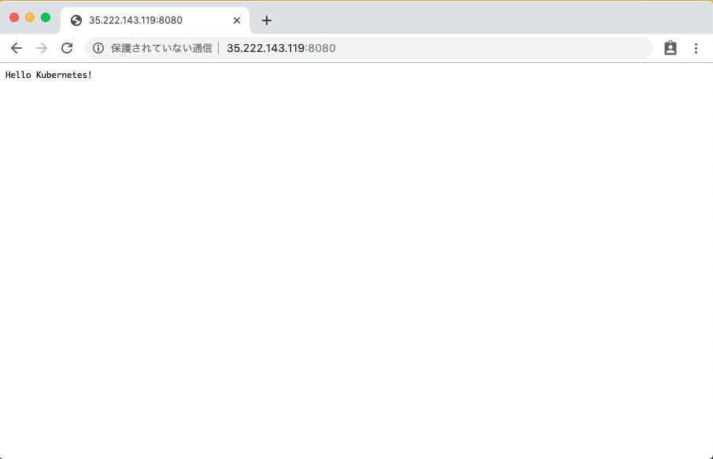

# Hello World

## これは何 ?

+ 公式ドキュメントにある Nginx を用いた Hello World を再現します
  + https://kubernetes.io/docs/tutorials/stateless-application/expose-external-ip-address/

## 実行方法

+ Deployment のデプロイします。

```
kubectl apply -f load-balancer-deployment.yaml
```

+ Deployment の確認します。

```
kubectl get deployments
```
```
$ kubectl get deployments
NAME          READY   UP-TO-DATE   AVAILABLE   AGE
hello-world   2/2     2            2           16m
```

+ さらに詳しく確認します。

```
kubectl describe deployments hello-world
```
```
$ kubectl describe deployments hello-world
Name:                   hello-world
Namespace:              default
CreationTimestamp:      Fri, 06 Dec 2019 20:08:53 +0900
Labels:                 app.kubernetes.io/name=load-balacer-example
Annotations:            deployment.kubernetes.io/revision: 1
Selector:               app.kubernetes.io/name=load-balancer-example
Replicas:               2 desired | 2 updated | 2 total | 2 available | 0 unavailable
.
.
.
割愛
```

+ ReplicaSet の確認をします。

```
kubectl get replicasets
```
```
$ kubectl get replicasets
NAME                     DESIRED   CURRENT   READY   AGE
hello-world-5885cc9fd8   2         2         2       17m
```

+ さらに詳しく確認します。

```
kubectl describe replicasets
```
```
$ kubectl describe replicasets
Name:           hello-world-5885cc9fd8
Namespace:      default
Selector:       app.kubernetes.io/name=load-balancer-example,pod-template-hash=5885cc9fd8
Labels:         app.kubernetes.io/name=load-balancer-example
                pod-template-hash=5885cc9fd8
Annotations:    deployment.kubernetes.io/desired-replicas: 2
                deployment.kubernetes.io/max-replicas: 3
.
.
.
割愛
```

## Service の作成

+ Service のデプロイします。

```
kubectl create -f load-balancer-service.yaml
```

+ Service の確認します。

```
kubectl get services
```
```
$ kubectl get services
NAME         TYPE           CLUSTER-IP      EXTERNAL-IP      PORT(S)          AGE
kubernetes   ClusterIP      10.31.240.1     <none>           443/TCP          23m
my-serv      LoadBalancer   10.31.240.227   35.222.143.119   8080:31364/TCP   15m
```

+ さらに詳しく確認します。

```
kubectl get services my-serv
```
```
$ kubectl get services my-serv
NAME      TYPE           CLUSTER-IP      EXTERNAL-IP      PORT(S)          AGE
my-serv   LoadBalancer   10.31.240.227   35.222.143.119   8080:31364/TCP   16m
```

## ブラウザから確認

+ Service で作成した LoadBalancer で付与された {EXTERNAL-IP} と {PORT(S)} をブラウザで確認します。



## リソースの削除

+ Service の削除します。

```
kubectl delete -f load-balancer-service.yaml
```

+ 確認します。

```
### 例

$ kubectl get services
NAME         TYPE        CLUSTER-IP    EXTERNAL-IP   PORT(S)   AGE
kubernetes   ClusterIP   10.31.240.1   <none>        443/TCP   29m
```

+ Deployment の削除します。

```
kubectl delete -f load-balancer-deployment.yaml
```

+ 確認します。

```
$ kubectl get deployment
No resources found.
```

以上になります!!

お疲れさまでした!!:raised_hands:


