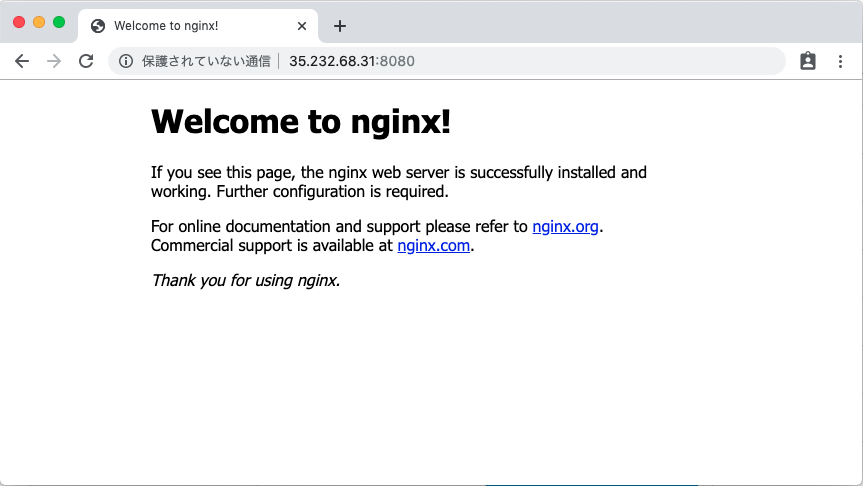

# Nginx を使用したシンプルなサンプル

## 構成

WIP

## 構築

### deployment

+ deployment のデプロイ

```
kubectl create -f nginx-deployment.yaml
```

+ deployment の確認

```
kubectl get deployment
```
```
### ex.

$ kubectl get deployment
NAME               READY   UP-TO-DATE   AVAILABLE   AGE
nginx-deployment   3/3     3            3           43s
```

### Service


+ Service のデプロイ

```
kubectl create -f nginx-service-loadbalancer.yaml
```

+ service の確認
  + EXTERNAL-IP が `<pending>` から `<IPアドレス>` になるまで少し時間がかかります。

```
kubectl get service
```
```
### ex.


$ kubectl get service
NAME            TYPE           CLUSTER-IP      EXTERNAL-IP   PORT(S)          AGE
kubernetes      ClusterIP      10.31.240.1     <none>        443/TCP          10m
nginx-serv-lb   LoadBalancer   10.31.254.139   <pending>     8080:31511/TCP   27s


↓ …しばらくすると


$ kubectl get service
NAME            TYPE           CLUSTER-IP      EXTERNAL-IP    PORT(S)          AGE
kubernetes      ClusterIP      10.31.240.1     <none>         443/TCP          11m
nginx-serv-lb   LoadBalancer   10.31.254.139   35.232.68.31   8080:31511/TCP   86s
```

## 確認

+ `kubectl get service` コマンドで確認出来る `EXTERNAL-IP` と `PORT(S)` を自分の端末から確認してみましょう。





## 削除

### Service

+ Service の削除

```
kubectl delete -f nginx-service-loadbalancer.yaml
OR
kubectl delete nginx-serv-lb 
```

+ 確認
  + `nginx-serv-lb` が消えているのが分かります。

```
$ kubectl get service
NAME         TYPE        CLUSTER-IP    EXTERNAL-IP   PORT(S)   AGE
kubernetes   ClusterIP   10.31.240.1   <none>        443/TCP   31m
```

### deployment

```
kubectl delete -f nginx-deployment.yaml
```

+ 確認
  + `nginx-deployment` が消えているのが分かります。

```
$ kubectl get deployment
No resources found.
```

