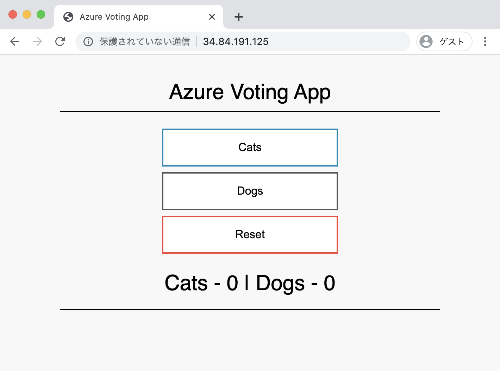

# Sample Vote

## 資料

[AKS] Tutorial

+ Run applications in Azure Kubernetes Service
  + https://docs.microsoft.com/en-us/azure/aks/tutorial-kubernetes-deploy-application

+ GitHub
  + https://github.com/Azure-Samples/azure-voting-app-redis.git


## 流れ

+ 作成
    + [ 1. Redsisを用意する]()
    + [2. フロントのアプリを作成する]()
    + [3. ブラウザで確認する]()
+ 削除
    + hogehoge

## 投票システムの作成

+ Namespace を作る

```
kubectl create -f 01_namespace.yaml
```

### Create Redis Pod

+ redis の deployment 作成

```
kubectl create -f 11_back-redis-deployment.yaml
```

+ podsの確認

```
kubectl get pods --namespace=sample-vote
```
```
### Ex

# kubectl get pods --namespace=sample-vote
NAME                               READY   STATUS              RESTARTS   AGE
azure-vote-back-5775d78ff5-p6qpc   0/1     ContainerCreating   0          6s
```

+ deploymentの確認

```
kubectl get deployments --namespace=sample-vote
```
```
### Ex

# kubectl get deployments --namespace=sample-vote
NAME              READY   UP-TO-DATE   AVAILABLE   AGE
azure-vote-back   1/1     1            1           18s
```

+ redisのserviceを起動

```
kubectl create -f 12_back-redis-service.yaml 
```

+ redisのserviceを確認

```
kubectl get services --namespace=sample-vote
```
```
### Ex

# kubectl get services --namespace=sample-vote
NAME              TYPE        CLUSTER-IP    EXTERNAL-IP   PORT(S)    AGE
azure-vote-back   ClusterIP   10.0.38.134   <none>        6379/TCP   111s
```

### Create Front App Pod

+ フロントの deployment を作成する

```
kubectl create -f 21_front-app-deployment.yaml
```

+ podsの確認

```
kubectl get pods --namespace=sample-vote
```
```
### Ex

# kubectl get pods --namespace=sample-vote
NAME                                READY   STATUS    RESTARTS   AGE
azure-vote-back-5775d78ff5-p6qpc    1/1     Running   0          4m25s
azure-vote-front-559d85d4f7-gj4xh   1/1     Running   0          96s
```

+ deploymentの確認

```
kubectl get deployments --namespace=sample-vote
```
```
### Ex

# kubectl get deployments --namespace=sample-vote
NAME               READY   UP-TO-DATE   AVAILABLE   AGE
azure-vote-back    1/1     1            1           4m59s
azure-vote-front   1/1     1            1           2m10s
```

+ redis の service を起動
    + :yen: 課金対象です

```
kubectl create -f 22_front-app-service.yaml
```

+ redis の service を確認

```
kubectl get services --namespace=sample-vote
```
```
### Ex

# kubectl get services --namespace=sample-vote
NAME               TYPE           CLUSTER-IP    EXTERNAL-IP   PORT(S)        AGE
azure-vote-back    ClusterIP      10.0.38.134   <none>        6379/TCP       5m5s
azure-vote-front   LoadBalancer   10.0.39.216   <pending>     80:30961/TCP   9s

---
# kubectl get services --namespace=sample-vote
NAME               TYPE           CLUSTER-IP    EXTERNAL-IP     PORT(S)        AGE
azure-vote-back    ClusterIP      10.0.38.134   <none>          6379/TCP       6m13s
azure-vote-front   LoadBalancer   10.0.39.216   34.84.191.125   80:30961/TCP   77s
```

+ service の実行状況確認コマンド その1

```
kubectl describe services ${service名} --namespace=sample-vote
```
```
### 例

# kubectl describe services azure-vote-front --namespace=sample-vote
Name:                     azure-vote-front
Namespace:                sample-vote
Labels:                   <none>
Annotations:              <none>
Selector:                 app=azure-vote-front
Type:                     LoadBalancer
IP:                       10.0.39.216
LoadBalancer Ingress:     34.84.191.125
Port:                     <unset>  80/TCP
TargetPort:               80/TCP
NodePort:                 <unset>  30961/TCP
Endpoints:                10.4.0.3:80
Session Affinity:         None
External Traffic Policy:  Cluster
Events:
  Type    Reason                Age   From                Message
  ----    ------                ----  ----                -------
  Normal  EnsuringLoadBalancer  98s   service-controller  Ensuring load balancer
  Normal  EnsuredLoadBalancer   50s   service-controller  Ensured load balancer
```

+ service の実行状況確認コマンド その2

```
kubectl get services ${service名} --namespace=sample-vote
```
```
### 例

# kubectl get services azure-vote-front --namespace=sample-vote
NAME               TYPE           CLUSTER-IP    EXTERNAL-IP     PORT(S)        AGE
azure-vote-front   LoadBalancer   10.0.39.216   34.84.191.125   80:30961/TCP   2m6s
```

### Check Web Browser

`EXTERNAL-IP` で表示されている IPアドレスをブラウザで確認する

+ 例
  + http://34.84.191.125




## Delete Resource

+ Delete App Pod

```
kubectl delete -f 22_front-app-service.yaml
kubectl delete -f 21_front-app-deployment.yaml
```

+ Delete Redis Pod

```
kubectl delete -f 12_back-redis-service.yaml 
kubectl delete -f 11_back-redis-deployment.yaml
```

+ Delete NameSpace

```
kubectl delete -f 01_namespace.yaml
```
